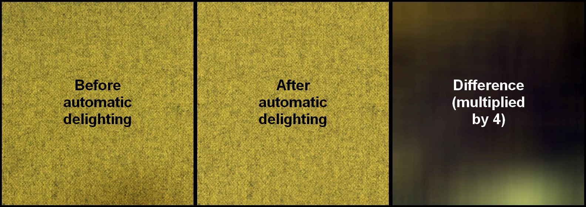
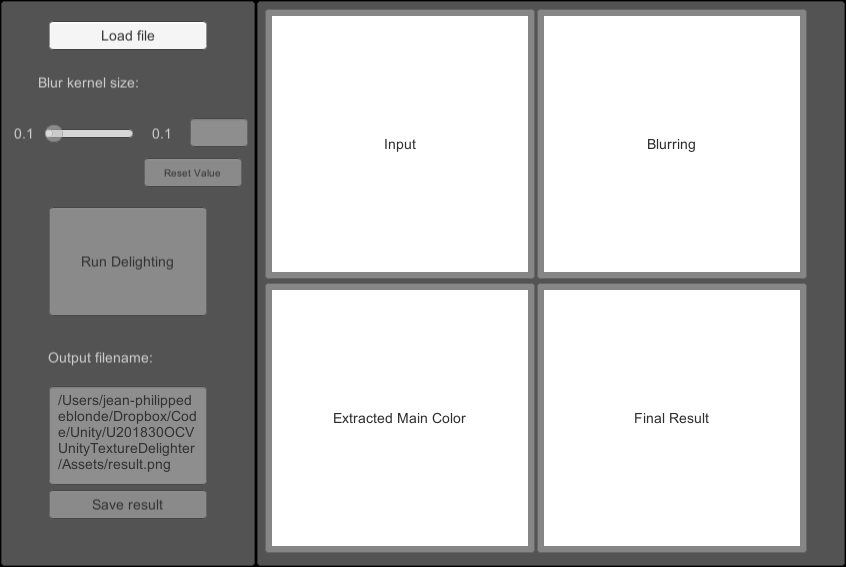
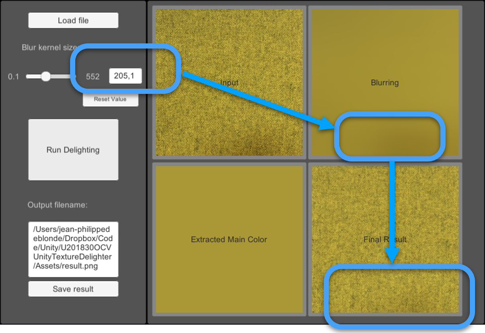
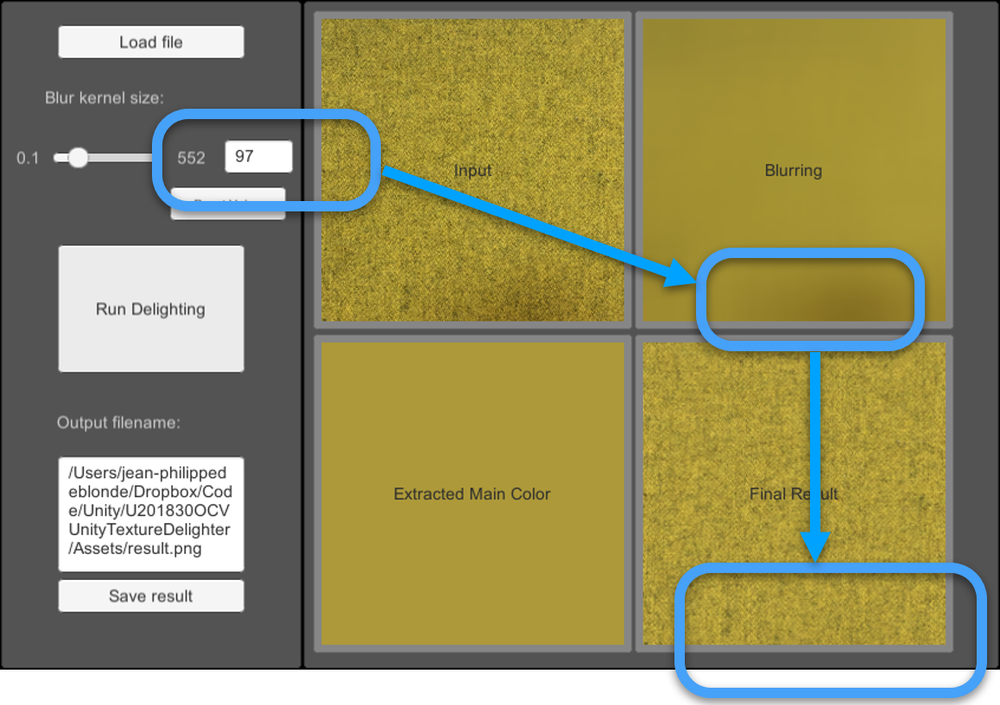
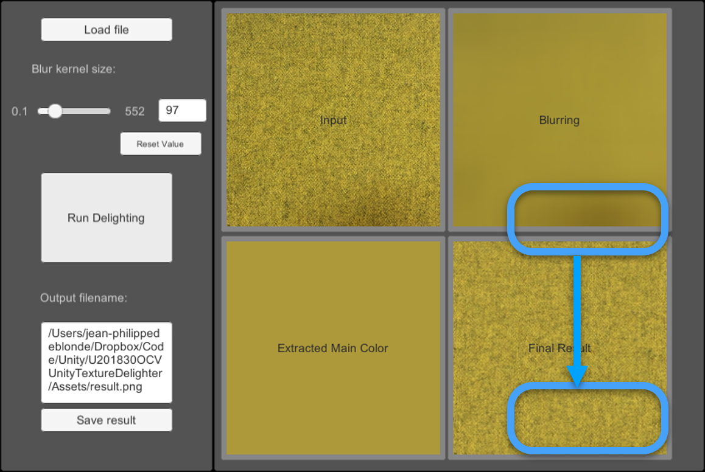

# Quick’n’dirty Delighter V1.0

QnDelighter is an app that can remove shadows and highlight from a photo, to use it as a tillable texture.

The app is made with Unity, and can be run on Windows & OSX.
You can grab precomplied binaries from the Releases page.

## System Requirements
Unity 2018.3 or more (the script should work on lower version, but the minimum version I used was that one)
Usage of OpenCV plus Unity asset: https://assetstore.unity.com/packages/tools/integration/opencv-plus-unity-85928

The app has been tested on OSX and Windows 10.

## Quick usage

On application start, the majority of the buttons are disabled.

You need to load a texture via the **'Load file'** button

![Image002]Documentation/(image002.png "")

When the texture is loaded, you can see it appearing in the **'Input'** panel.

When you modify the size of the blur kernel, you will change the **'scale'** of the highlights/shadows that will be removed.

Blur Kernel of 205-wide and blur kernel 97-wide. Notice how the shadow blob disappears from the image with the second value.

Press « Run Delighting » to execute the process, and display the result.
The « Save result » button will save on disk the image displayed in the **'Final Result'** panel.

The algorithm works well when there's only *one* 'mix' or variation of a color. For example yellow on black, has in the provided example.
If you have two (or more) color mixed, it's better to delight the Y channel of an YCbCr/YUV color (to avoid losing colors).

## The app
The GUI is really bad, Unity isn't really made for that kind of '3D/image' tool. If somebody has some good tips to provide something more stylish, you can always drop me a mail.

The native file browsing is provided by **UnityStandaloneFileBrowser** : https://github.com/gkngkc/UnityStandaloneFileBrowser

## How it works

### Algorithm
In real life, highlights and shadows variations are essentially low frequency changes over an area in picture consired for textures.

This tool is essentially removing the low frequency band of the image, this band containing the light & shadow variation.

It works well with textures mixing one color variation against black or gray.

If you have two or more color mixed, aplly the algorithm on the Y channel of the YCbCr or YUV version of the image (or on the Luminosity channel of a CIELab version).

An old GIMP plugin was doing the same with 'multiband' separation by doing multiples frequency separation with a wavelet transform and then recombining them after touching a specific band (https://docs.gimp.org/2.10/en/plug-in-wavelet-decompose.html)

This tool is essentially doing it for one band only.

To calculate the size of the blur, I have devised a simple rule: kernel_size = image_width/2^(4-1) + image_width/2^4 . This heuristics works for a good range of images, but can be tweaked for a better result in some cases.

The core of the algorithm is in the function *''public IEnumerator delighting()'**, everything else is related to the GUI or the loading/saving of files in Unity.

You can find some helper functions related to k-means for principal color extraction, but it's a bit slow. The extraction of the principal color is based on getting the maximum value of the histogram of the image (it's the color you'll find the most in the image).

### Limitations

The low frequency of the light/shadow variation is approximated with a Gaussian Blur. However the way that blur is implemented lead to a 'cross shaped' blur at high-level of blur.

The best way would be to downsample the image, and upsample it via a spline based interpolation.

## TODO
Provide a more stylish GUI

Implement the delighting in the YCbCr or CIELab color space, to prevent color shift when a texture is made by mixing two colors patterns.

## License
OpenCV plus Unity is adapted from OpenCVSharp, wich is licensed under the BSD-3 clause license (https://github.com/shimat/opencvsharp/blob/master/LICENSE)

The C# code of the app and the Unity project is MIT licensed : https://github.com/github-for-unity/Unity/blob/master/LICENSE [copy file]
